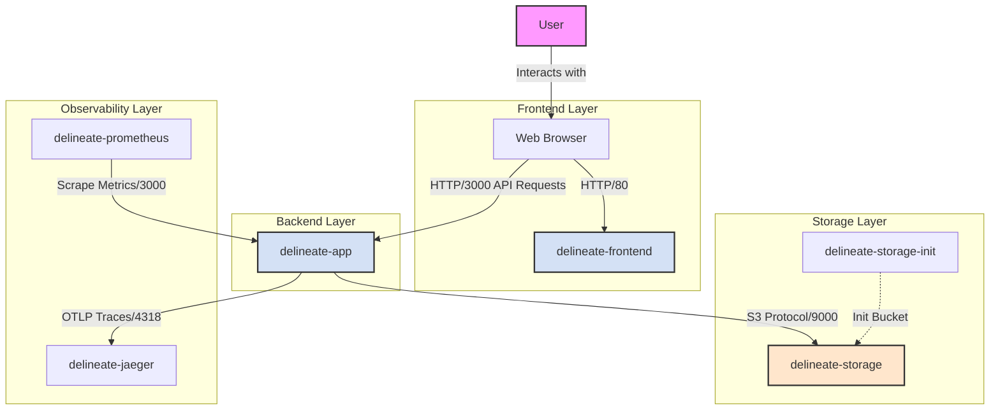

# System Architecture

This document describes the current architecture of the Delineate Hackathon Challenge application, based on the codebase and Docker configuration.

## Architecture Diagram

## Component Overview

| Service                  | Type       | Tech Stack    | Description                                                                                             |
| ------------------------ | ---------- | ------------- | ------------------------------------------------------------------------------------------------------- |
| **delineate-frontend**   | Frontend   | React, Vite   | Serves the user interface. Accessible on port `80` (Prod) or `5173` (Dev).                              |
| **delineate-app**        | Backend    | Node.js, Hono | Main API server. Handles download requests and simulates long-running tasks. Accessible on port `3000`. |
| **delineate-storage**    | Storage    | RustFS        | S3-compatible object storage for saving files.                                                          |
| **delineate-jaeger**     | Tracing    | Jaeger        | Collects and visualizes distributed traces via OTLP.                                                    |
| **delineate-prometheus** | Monitoring | Prometheus    | Scrapes metrics from the backend for monitoring.                                                        |

> [!NOTE]
> This architecture reflects the current implementation found in `docker/compose.*.yml` and `src/`. It differs from the design in `ARCHITECTURE.md` (which mentions Redis, BullMQ, and Postgres) as those components are not currently present in the Docker configuration or project dependencies.
